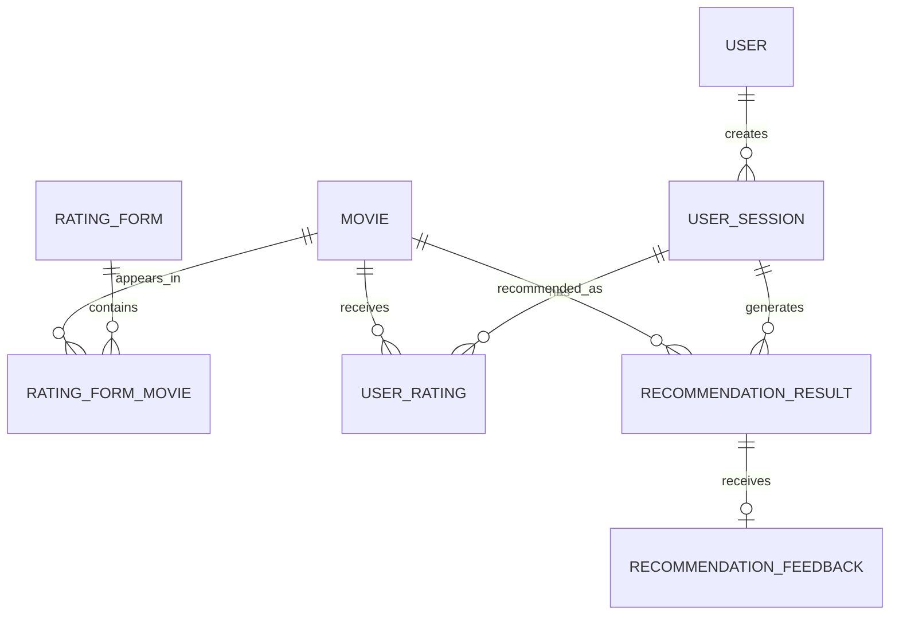

# 电影推荐博客后端功能模块与统计界面设计

## 1. 文档目的

本文档梳理项目当前已经实现的后端功能、核心数据模型、权限边界、管理后台能力和推荐算法统计口径，并给出后台界面与数据可视化的优化建议。

文档中的内容分为两类：

- **当前已实现**：可直接在现有 Django 项目中使用的功能。
- **建议新增**：为了优化后台界面、提高运营效率和评估推荐算法而建议增加的功能。

当前本地 SQLite 数据状态：电影库 1001 部、豆瓣电影排行榜 10 条、一周口碑榜 6 条、有效评分表 5 套。

## 2. 后端总体结构

| Django App | 主要职责 | 核心对象 |
| --- | --- | --- |
| `apps.blog` | 首页内容、豆瓣榜单、片讯、榜单同步、海报代理 | 榜单电影、口碑电影、近期片讯 |
| `apps.movies` | 本地电影资料库、详情页、海报缓存、电影分类 | 电影 |
| `apps.ratings` | 推荐分类选择、评分表、用户偏好评分、推荐会话 | 评分表、推荐会话、偏好评分 |
| `apps.recommendations` | 推荐算法、推荐结果、推荐后反馈、算法统计 | 推荐结果、推荐反馈 |
| `apps.accounts` | 注册登录、退出、用户推荐历史 | Django 用户、用户推荐历史 |
| Django Admin | 内容维护、用户权限、推荐数据和反馈明细管理 | 所有后台模型 |

## 3. 账户与权限模块

### 3.1 当前已实现

- 使用 Django 内置用户体系，以用户名和密码注册、登录。
- 注册成功后自动登录并跳转首页。
- 登录用户创建的推荐会话会关联到当前用户。
- 游客也能完成推荐流程，使用 UUID 标识匿名会话。
- 登录用户只能在“我的推荐”中查看自己的推荐历史。
- 推荐算法统计页仅允许 `is_staff=True` 的后台用户访问。
- Django Admin 通过用户、组、`is_staff`、`is_superuser` 和模型权限控制访问。

### 3.2 权限矩阵

| 功能 | 游客 | 登录用户 | Staff | 超级管理员 |
| --- | --- | --- | --- | --- |
| 浏览首页和电影详情 | 允许 | 允许 | 允许 | 允许 |
| 创建推荐会话 | 允许 | 允许并绑定账号 | 允许并绑定账号 | 允许并绑定账号 |
| 提交推荐前评分 | 允许 | 允许 | 允许 | 允许 |
| 查看 UUID 推荐结果 | 允许 | 允许 | 允许 | 允许 |
| 提交推荐反馈 | 允许 | 允许 | 允许 | 允许 |
| 查看个人推荐历史 | 跳转登录 | 仅本人 | 仅本人 | 仅本人 |
| 查看算法统计 | 跳转登录 | 403 | 允许 | 允许 |
| 进入 Django Admin | 禁止 | 取决于权限 | 允许 | 允许全部操作 |

### 3.3 后续安全优化建议

- 推荐结果页当前采用“持有 UUID 即可访问”的分享式权限。若推荐记录包含敏感信息，可增加会话所有者校验或一次性分享令牌。
- 对游客反馈增加会话 Cookie 校验，降低他人拿到 UUID 后修改反馈的风险。
- 对推荐、反馈提交接口增加速率限制和异常提交日志。
- 在后台记录管理员的重要新增、修改、删除操作。

## 4. 博客内容管理模块

### 4.1 豆瓣电影排行榜

模型：`DoubanChartMovie`

主要字段：豆瓣 ID、排名、中文名、副标题、信息摘要、评分、评价人数、海报地址、豆瓣详情地址、抓取时间、启用状态、创建时间、更新时间。

当前功能：

- 从豆瓣同步排行榜数据。
- 后台按启用状态、抓取时间筛选。
- 按名称、副标题、豆瓣 ID 搜索。
- 首页默认展示有效榜单中的前 6 条。
- 海报请求失败时通过本站代理和备用豆瓣图片域名加载。

### 4.2 豆瓣一周口碑榜

模型：`DoubanWeeklyReputationMovie`

字段与排行榜基本一致，单独保存和同步，首页默认展示前 6 条。

### 4.3 近期片讯

模型：`UpcomingMovieNews`

主要字段：中文名、原名、内容类型、地区、日期、日期标签、类型文字、海报、预告片、来源名称、来源地址、简介、启用状态、排序值。

内容类型：

- `upcoming`：近期预告。
- `now_showing`：正在热播。

地区：

- `domestic`：国内。
- `foreign`：国外。

### 4.4 建议的后台界面

- 顶部状态卡：有效榜单数、有效口碑榜数、有效片讯数、最近同步时间。
- 同步状态表：数据源、最后成功时间、记录数、状态、失败原因、手动同步按钮。
- 内容日历：按日期展示即将上映和正在热播内容。
- 数据质量提示：缺少海报、缺少来源、重复豆瓣 ID、过期片讯数量。

## 5. 电影资料库模块

模型：`Movie`

### 5.1 数据字段

| 字段 | 说明 |
| --- | --- |
| `douban_id` | 豆瓣电影 ID，非空时唯一 |
| `title` / `original_title` | 中文名和原名 |
| `year` | 上映年份 |
| `directors` / `actors` | JSON 数组 |
| `genres` / `countries` | 类型和国家地区 JSON 数组 |
| `rating` / `rating_count` | 豆瓣评分和评价人数 |
| `rank` | 数据集排名 |
| `poster_url` | 海报地址 |
| `summary` | 电影简介 |
| `main_category` | 系统五大推荐分类之一 |
| `feature_tags` | 算法使用的特征标签 JSON 数组 |

### 5.2 五大推荐分类

| 分类代码 | 中文名称 |
| --- | --- |
| `suspense_crime` | 悬疑犯罪 |
| `romance_drama` | 爱情剧情 |
| `comedy_animation` | 喜剧动画 |
| `sci_fi_action` | 科幻动作冒险 |
| `history_war_biography` | 历史战争传记 |

### 5.3 当前后台能力

- 按主分类、年份筛选。
- 按中文名、原名、豆瓣 ID 搜索。
- 查看标题、年份、主分类、评分和排名。
- 支持 CSV 导入、导入前校验和海报缓存命令。

### 5.4 建议增加的数据质量面板

- 各分类电影数量柱状图。
- 各年份电影数量折线图或面积图。
- 豆瓣评分分布直方图。
- 缺少海报、简介、导演、演员、特征标签的电影数量。
- 重复标题、异常年份、异常评分、无豆瓣 ID 数据清单。
- 各分类平均评分与平均评价人数对比图。

## 6. 评分表与推荐会话模块

### 6.1 评分表

模型：`RatingForm`、`RatingFormMovie`

- 每个推荐分类对应一套有效评分表。
- 每套评分表默认选取 20 部代表电影。
- 前 8 部标记为必需参考项，页面最终要求用户至少评价 8 部。
- 代表电影优先按豆瓣评分、评价人数、排名选择，并尽量覆盖不同首要类型。

### 6.2 推荐会话

模型：`UserSession`

主要字段：UUID、选择分类、关联用户、创建时间、完成时间。

- 登录用户会话关联 Django 用户。
- 游客会话的 `user` 为空。
- `completed_at` 在推荐结果生成完成后写入。
- 用户历史页按创建时间倒序展示会话。

### 6.3 推荐前偏好评分

模型：`UserRating`

- 每条记录关联一个会话和一部电影。
- 评分范围为 1 至 5 分。
- 同一会话对同一电影只允许一条评分。
- 评分用于构建用户偏好，不等同于推荐结果反馈。

### 6.4 建议增加的会话统计

- 今日、近 7 日、近 30 日推荐会话数。
- 登录用户会话与游客会话占比。
- 已完成会话数和会话完成率。
- 五大分类的选择次数及占比。
- 每个会话的平均偏好评分数量。
- 从创建会话到完成推荐的平均耗时。
- 每日活跃推荐用户数和新注册用户数。

## 7. 推荐算法模块

### 7.1 当前算法流程

1. 读取当前会话的用户偏好评分。
2. 将 1 至 5 分转换为权重：`1=-2.0`、`2=-1.0`、`3=0.2`、`4=1.0`、`5=2.0`。
3. 根据类型、导演、演员、国家、年份和特征标签计算候选电影相似度。
4. 结合分类匹配、豆瓣质量、流行度和多样性得到最终分数。
5. 排除用户已经评价过的电影。
6. 按得分排序，并限制同一导演最多出现 3 次。
7. 保存 Top20 推荐结果、排名、得分、理由和算法版本。

### 7.2 电影相似度权重

| 因素 | 权重 |
| --- | ---: |
| 类型相似度 | 40% |
| 导演相似度 | 15% |
| 演员相似度 | 15% |
| 国家地区相似度 | 10% |
| 年份相似度 | 10% |
| 特征标签相似度 | 10% |

### 7.3 参数组

| 参数组 | 相似度 | 分类 | 豆瓣质量 | 流行度 | 多样性 | 触发条件 |
| --- | ---: | ---: | ---: | ---: | ---: | --- |
| `type_first` | 35% | 35% | 15% | 10% | 5% | 评分少于 12 部 |
| `quality_first` | 30% | 20% | 30% | 15% | 5% | 评分全部相同或方差小于 0.35 |
| `similarity_first` | 50% | 20% | 15% | 10% | 5% | 评分充分且差异明显 |

当前保存的算法版本为 `taskcf_v1`。参数组名称目前没有写入数据库，因此后台暂时不能直接比较三种参数组的效果。

### 7.4 建议补充的算法审计字段

为了更准确地解释和对比算法，建议在推荐会话或推荐结果中增加：

- `parameter_group`：本次实际使用的参数组。
- `similarity_score`、`category_score`、`quality_score`、`popularity_score`、`diversity_score`：各分项得分。
- `candidate_count`：生成推荐前的候选电影数量。
- `generation_duration_ms`：算法执行耗时。
- `experiment_group`：A/B 测试实验组。
- `algorithm_config`：当次算法权重快照，建议使用 JSONField。

## 8. 推荐结果与反馈模块

### 8.1 推荐结果

模型：`RecommendationResult`

主要字段：推荐会话、电影、最终得分、推荐排名、推荐理由、算法版本、创建时间。

约束：

- 同一会话不能重复推荐同一部电影。
- 同一会话不能出现重复排名。

### 8.2 推荐后反馈

模型：`RecommendationFeedback`

- 每条反馈关联一条推荐结果。
- 评分范围为 1 至 5 分。
- 推荐结果与反馈是一对一关系，因此每部推荐电影只保留一条最新反馈。
- 再次提交会更新已有评分。
- 留空不会删除旧反馈。
- 可通过推荐结果继续追溯会话、用户、分类、电影、排名和算法版本。

### 8.3 管理后台三级目录

1. **分类层**：展示五大分类的反馈数、反馈用户数和平均分。
2. **用户层**：展示该分类下各登录用户及游客的反馈数和平均分。
3. **明细层**：展示指定用户在指定分类下对每部推荐电影的评分、排名、算法版本、算法得分和更新时间。

## 9. 当前算法统计口径

访问地址：`/analytics/recommendations/`，仅 Staff 可访问。

### 9.1 核心指标

| 指标 | 计算公式 |
| --- | --- |
| 推荐结果总数 | `RecommendationResult` 总记录数 |
| 反馈数 | `RecommendationFeedback` 总记录数 |
| 反馈覆盖率 | 反馈数 / 推荐结果数 × 100% |
| 平均反馈分 | 所有反馈 `rating` 的平均值 |
| 好评率 | 评分大于等于 4 的反馈数 / 反馈数 × 100% |
| 差评率 | 评分小于等于 2 的反馈数 / 反馈数 × 100% |

### 9.2 当前分组

- 按推荐排名：Top1、Top2-5、Top6-10、Top11-20。
- 按算法版本：例如 `taskcf_v1`。
- 按推荐分类：五大电影分类。

### 9.3 统计解读注意事项

- 反馈覆盖率低时，平均分可能只代表愿意反馈的用户，不能完全代表全体用户。
- 游客会被统一显示为“游客”，目前无法准确区分游客人数；只能区分游客会话。
- 同一用户可创建多次会话，因此“会话数”不能直接当作“用户数”。
- 当前只有主观评分，没有点击、收藏、观看完成等行为指标。
- 算法版本固定时，算法版本对比表无法产生实验结论。

## 10. 推荐的统计仪表盘

建议把后台统计首页划分为四个区域，并提供统一时间范围筛选：今日、近 7 日、近 30 日、全部、自定义日期。

### 10.1 业务概览

指标卡：

- 注册用户总数。
- 推荐会话总数。
- 已完成会话数。
- 会话完成率。
- 推荐结果总数。
- 反馈覆盖率。
- 平均反馈分。
- 好评率。

图表：

- **双轴趋势图**：每日推荐会话数与每日反馈数。
- **漏斗图**：创建会话 → 提交至少 8 条偏好评分 → 生成推荐 → 提交至少 1 条反馈。
- **环形图**：登录用户会话与游客会话占比。
- **柱状图**：五大分类的会话数量。

### 10.2 算法效果

- **分组柱状图**：五大分类的平均反馈分、好评率、差评率。
- **排名折线图**：推荐排名 1 至 20 对应的平均反馈分。
- **排名区间柱状图**：Top1、Top2-5、Top6-10、Top11-20 的反馈覆盖率和好评率。
- **算法版本对比图**：不同版本的平均分、好评率、覆盖率。
- **评分分布图**：1 至 5 分反馈数量和占比。
- **热力图**：推荐分类 × 反馈评分，查看不同分类的满意度分布。

建议优先观察：

- Top1 的平均反馈是否高于后续排名。
- 排名越靠后，平均反馈是否持续下降。
- 分类匹配准确时是否能获得更高评分。
- 不同算法版本是否同时提高平均分和反馈覆盖率。

### 10.3 用户与偏好

- **评分分布图**：推荐前 1 至 5 分偏好评分数量。
- **活跃用户榜**：完成会话数、反馈数、平均反馈分。
- **用户留存表**：首次推荐后 7 日或 30 日内再次推荐的用户占比。
- **偏好与反馈对照图**：用户推荐前平均评分与推荐后平均反馈分的关系。
- **分类迁移图**：同一用户在不同推荐会话选择分类的变化；数据量较小时可使用矩阵表替代桑基图。

### 10.4 内容与电影

- **高满意电影榜**：反馈数达到最低样本量后，按平均反馈分排序。
- **低满意电影榜**：反馈数达到最低样本量后，按平均反馈分升序排列。
- **高曝光低反馈电影**：推荐次数高但反馈覆盖率低。
- **高分低曝光电影**：反馈好但推荐次数少，检查候选排序是否合理。
- **推荐次数与满意度散点图**：横轴推荐次数，纵轴平均反馈分，气泡大小为反馈数。
- **类型覆盖图**：推荐结果中各类型、导演、国家地区的分布，用于评估多样性。

## 11. 可直接实现与需要新增数据的图表

### 11.1 使用现有数据即可实现

- 会话数、完成会话数、完成率。
- 登录用户与游客会话占比。
- 分类使用次数和占比。
- 每日会话、推荐结果、反馈趋势。
- 1 至 5 分反馈分布。
- 按排名、分类、算法版本统计平均分和好差评率。
- 推荐电影次数榜、平均反馈榜。
- 登录用户的会话数和反馈活跃度。
- 从会话创建到推荐完成的耗时统计。

### 11.2 需要新增字段或埋点

| 目标 | 需要增加的数据 |
| --- | --- |
| 推荐卡点击率 | 推荐结果点击事件、点击时间 |
| 收藏率 | 用户收藏关系或收藏事件 |
| 观看转化率 | 跳转播放、标记已看或播放完成事件 |
| 参数组效果对比 | 保存 `parameter_group` |
| 算法分项解释 | 保存各分项得分和权重快照 |
| 算法性能监控 | 保存执行耗时、候选数量、异常信息 |
| 准确区分游客 | 匿名访客 ID 或独立 Cookie 标识 |
| A/B 测试 | 实验名称、实验组、分流时间 |

## 12. 后台统计接口建议

第一版可以继续使用 Django 服务端模板，不必引入前后端分离。视图通过 ORM 聚合数据，将 JSON 安全输出给 Chart.js 或 Apache ECharts。

建议路由：

| 路由 | 功能 |
| --- | --- |
| `/analytics/recommendations/` | 推荐分析总览 |
| `/analytics/users/` | 用户与会话分析 |
| `/analytics/movies/` | 电影内容和推荐表现 |
| `/analytics/data-quality/` | 数据质量与同步状态 |

建议公共筛选参数：

- `date_from`、`date_to`：时间范围。
- `category`：推荐分类。
- `algorithm_version`：算法版本。
- `user_type`：登录用户或游客。
- `rank_bucket`：推荐排名区间。

建议所有统计查询统一封装在 `apps.recommendations.services.analytics` 中，避免视图文件堆积 ORM 逻辑，并便于测试和未来提供 JSON API。

## 13. 界面布局建议

### 13.1 桌面端

1. 顶部：页面标题、最后更新时间、时间筛选、分类筛选、算法版本筛选。
2. 第一行：6 至 8 个核心指标卡。
3. 第二行：趋势图占三分之二，用户类型环形图占三分之一。
4. 第三行：流程漏斗图和分类效果柱状图。
5. 第四行：排名效果折线图和反馈评分分布图。
6. 底部：电影表现明细表，可排序、筛选和分页。

### 13.2 移动端

- 指标卡改为两列。
- 图表单列排列，最小高度 280px。
- 明细表允许横向滚动，关键字段固定在左侧。
- 筛选器放入抽屉或折叠区域。

### 13.3 颜色建议

- 主色保持当前橙棕色设计系统。
- 好评使用低饱和绿色。
- 中性评价使用金色或灰黄色。
- 差评使用低饱和红色。
- 游客与登录用户使用两种稳定、可区分且符合无障碍对比度的颜色。

## 14. 推荐实施优先级

### 第一阶段：不改数据模型

- 增加统一时间和分类筛选。
- 增加每日会话与反馈趋势图。
- 增加反馈评分分布图。
- 增加分类效果和排名效果图。
- 增加登录用户与游客占比图。
- 增加电影推荐表现明细表。

### 第二阶段：补充算法审计字段

- 保存参数组和算法权重快照。
- 保存各分项得分和算法执行耗时。
- 增加算法版本、参数组和分项得分对比。
- 引入正式 A/B 测试分组。

### 第三阶段：增加行为闭环

- 记录推荐卡点击、收藏、已看等事件。
- 增加点击率、收藏率和观看转化率。
- 增加用户留存与复访分析。
- 建立可导出的周报或月报。

## 15. 建议验收标准

- Staff 用户可查看统计页面，普通用户无法访问。
- 所有指标在无数据时显示 0，不出现除零错误。
- 时间、分类和算法版本筛选会同时作用于指标、图表和明细表。
- 图表数值与数据库 ORM 聚合结果一致。
- 页面在桌面、平板和手机尺寸下无异常横向溢出。
- 图表提供文字摘要、Tooltip 和可读颜色，不能只依赖颜色表达含义。
- 大数据量查询具备索引、分页和合理的查询次数。
- 新增统计服务具有指标口径单元测试和权限测试。

## 16. 核心数据关系



完整业务链路：

```text
注册或游客进入
    → 选择推荐分类
    → 创建推荐会话
    → 至少评价 8 部代表电影
    → 算法生成 Top20 推荐结果
    → 用户对推荐结果提交 1-5 分反馈
    → 后台按时间、分类、排名、算法版本、用户和电影统计效果
```
